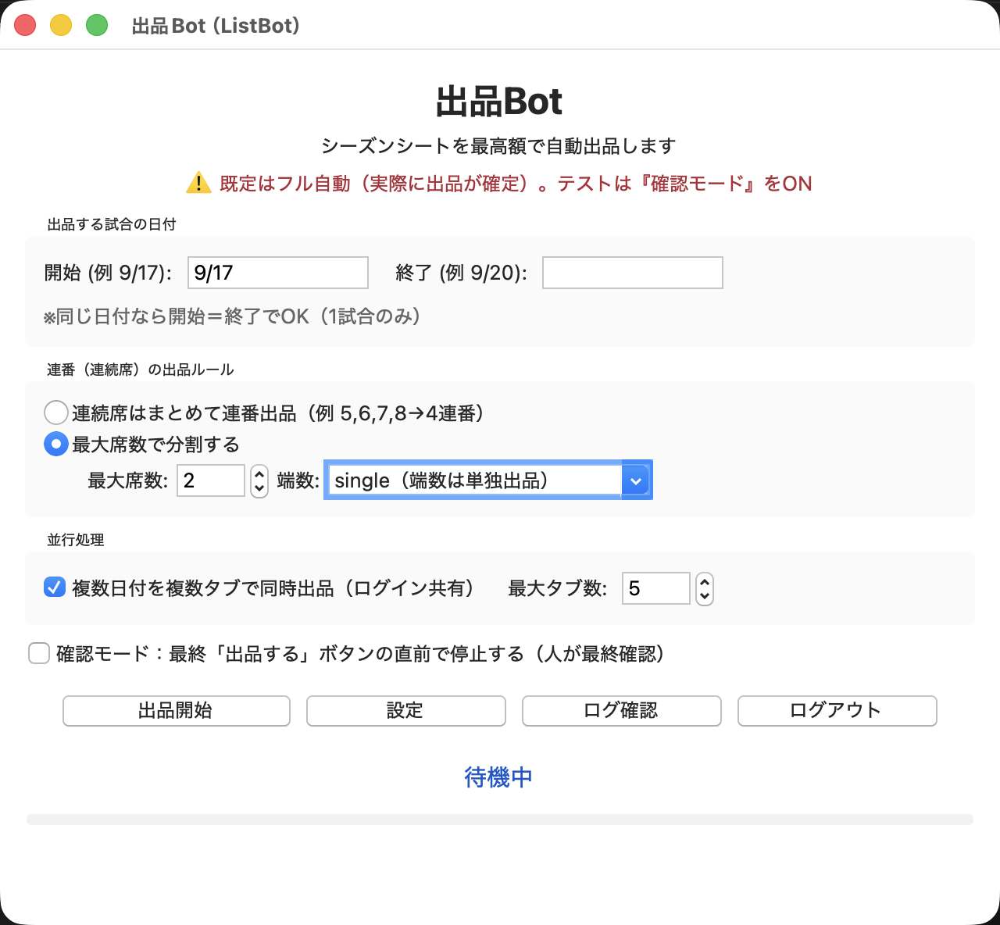
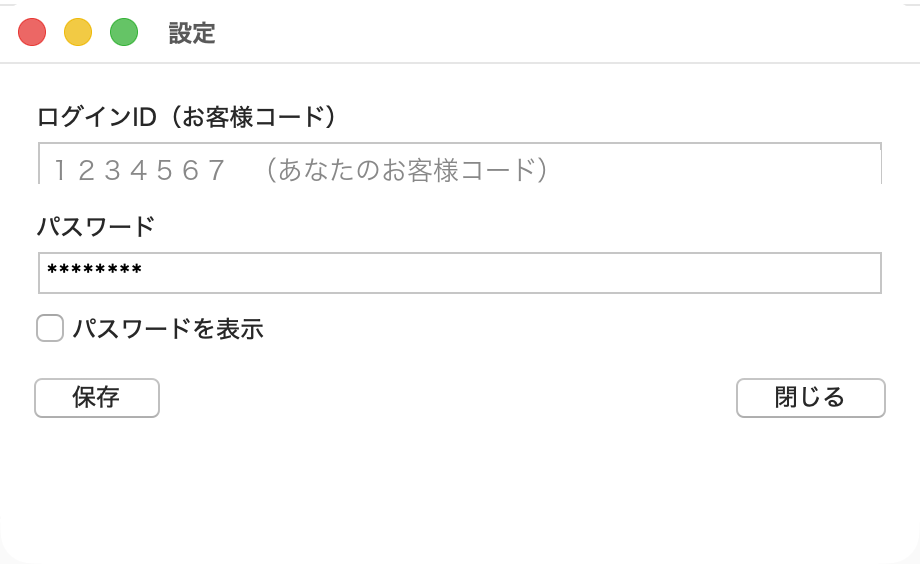
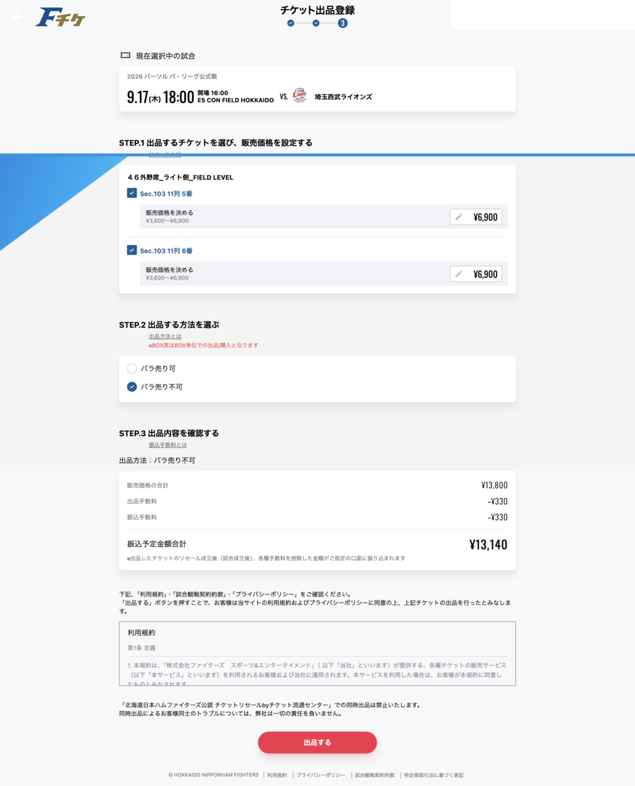
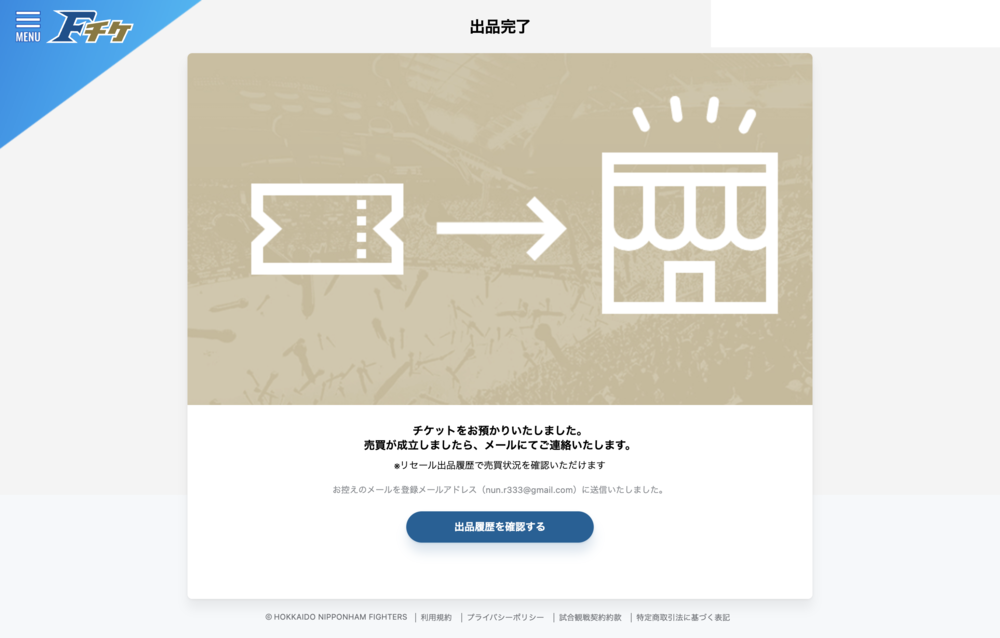

# 出品Bot（ListBot）かんたん使い方ガイド 🪟 **Windows用**

> はじめての方でも迷わないように、ダウンロードから出品・キャンセルまでを順番に説明します。
> 画面の図も載せています。困ったときは最後の「うまくいかないとき」を見てください。

---

## 0. このアプリは何をするもの？

**Fチケ（北海道日本ハムファイターズのチケットサイト）のシーズンシートを、指定した日付の試合について「自動で・最高額で・出品（販売登録）」してくれるアプリ**です。

- 自分でやると「日付を探す → 席を選ぶ → 価格を入力 → バラ売り設定 → 確認 → 出品」を席ごとに繰り返す必要があります。
- このアプリは、その作業を**全部自動**でやります。複数の日付を**同時に**処理することもできます。

> ### ⚠️ いちばん大事な注意
> このアプリは **本当にチケットを出品（販売登録）します**。
> 練習・お試しのときは、必ず後で説明する **「確認モード」** をオンにしてください（最後の出品ボタンを押す直前で止まります）。
> 間違えて出品してしまった場合は、自分で **「出品キャンセル」** ができます（→ 第8章）。

---

## 1. 最初に覚える用語（かんたん解説）

| 言葉 | 意味 |
|---|---|
| **出品（しゅっぴん）** | 自分の席を「売りに出す」こと。これをすると他の人が買えるようになります。 |
| **連番（れんばん）** | 隣どうしの続いた席のこと（例：5番・6番）。 |
| **バラ売り不可** | 連番をバラバラに売らず、**まとめて1セットで売る**設定（連番出品）。 |
| **バラ売り可** | 1席ずつ**バラバラでも売ってよい**設定。 |
| **最高額（さいこうがく）** | サイトが許す価格の範囲（例 ¥3,600〜¥6,900）の**いちばん高い金額**。このアプリは常にこれで出品します。 |
| **確認モード** | 最後の「出品する」ボタンを**押さずに止まる**安全モード（お試し用）。 |

---

## 2. ダウンロードとインストール

> インストール作業（難しい設定）は不要です。ダウンロードして展開（解凍）するだけです。

### 手順
1. 配布されたダウンロードリンクを開きます。
   - 出品Bot（Windows版）: **`ListBot-Windows.zip`**
2. ダウンロードした **`ListBot-Windows.zip`** を右クリック →「**すべて展開**」を選びます。
3. 展開先のフォルダを開くと、中に **`ListBot.exe`**（と `browser` フォルダなど）があります。

> 💡 `browser` フォルダはアプリが内部で使うものです。**消さないでください**。`ListBot.exe` と同じ場所に置いたまま使います。

---

## 3. はじめての起動（セキュリティ警告の通し方）

1. **`ListBot.exe`** をダブルクリックします。
2. 「**WindowsによってPCが保護されました**」という青い画面（SmartScreen）が出ることがあります。
   - これは「インターネットから来た見慣れないアプリ」への標準の警告です（ウイルスという意味ではありません）。
   - **「詳細情報」** をクリック → **「実行」** ボタンを押すと起動します。
3. しばらくすると、下のような **「出品Bot」** の画面が開きます。

---

## 4. 初期設定（ログインID・パスワードの登録）※最初の1回だけ

1. 画面の **［設定］** ボタンを押します（初回は自動で開くこともあります）。
2. 下の画面が出るので、**Fチケのログイン情報**を入力します。

   - **ログインID（お客様コード）**：Fチケにログインするときのお客様コード
   - **パスワード**：Fチケのパスワード（「パスワードを表示」で入力内容を確認できます）
3. **［保存］** を押します。「保存しました」と出ればOKです。**［閉じる］** でこの画面を閉じます。

> 🔐 入力した情報はあなたのPCの中だけに保存されます（次回からは入力不要）。

---

## 5. メイン画面の見方（各項目の意味）

| 画面の場所 | 何をする所か |
|---|---|
| **出品する試合の日付（開始／終了）** | 出品したい試合の日付を入れます。例：`9/17` 〜 `9/20`。1試合だけなら開始＝終了でOK。 |
| **連番の出品ルール** | 続いた席をどう売るかを選びます（→ 第6章でくわしく）。 |
| **並行処理** | チェックを入れると、複数の日付を**同時に**処理して速くなります。「最大タブ数」は同時に開く画面の数。 |
| **確認モード** | チェックを入れると、最後の「出品する」直前で**止まります**（お試し用）。 |
| **［出品開始］** | 自動出品をスタート。 |
| **［設定］** | ログインID・パスワードの登録（第4章）。 |
| **［ログ確認］** | これまでの動作記録を見る。 |
| **［ログアウト］** | ログイン情報を消して、次回ログインからやり直す。 |

---

## 6. 連番ルールの選び方（具体例つき）

「続いた席（連番）をどう売るか」を選べます。

### ① 連続席はまとめて連番出品（おすすめ・初期設定）
続いた席を**1セットにまとめて**売ります。

| 持っている席 | 出品のされ方 |
|---|---|
| 5番・6番 | **[5,6の2連番]** を1セットで |
| 5番・6番・7番・8番 | **[5,6,7,8の4連番]** を1セットで |

### ② 最大席数で分割する
「1セット◯席まで」で区切ります。「最大席数」と「端数（はんすう＝あまり）の扱い」を選べます。

例：**最大席数＝2** のとき

| 持っている席 | 端数=single（あまりは単独で売る） | 端数=merge（あまりは前にくっつける） |
|---|---|---|
| 5・6・7・8番 | [5,6] [7,8] | [5,6] [7,8] |
| 5・6・7番（3連番） | [5,6] ＋ [7]（単独） | [5,6,7]（3連番にまとめる） |
| 5・6・7・8・9番（5連番） | [5,6] [7,8] ＋ [9] | [5,6] [7,8,9] |

> 💡 **離れている席**（例 5番と10番）は自動的に別グループになります。区画（Sec）や列が違う席も別グループです。
> 💡 **1席だけ**のグループは自動で「バラ売り可（単独売り）」になります。

---

## 7. 実行から完了までの流れ

> はじめは **「確認モード」にチェックを入れて**お試しすることを強くおすすめします。

1. 日付（開始・終了）を入れる
2. 連番ルールを選ぶ
3. （お試しなら）**確認モードにチェック**
4. **［出品開始］** を押す
5. 確認のメッセージが出るので「はい」を押す
6. ブラウザが自動で開き、**ログイン → 一番下までスクロール → 対象日付の席を自動で選んで価格入力 → バラ売り設定** と進みます

アプリが自動で入力した「確認画面」はこのようになります（5番・6番をそれぞれ最高額¥6,900・バラ売り不可で出品する例）👇

7-A. **確認モードがオンのとき**：この**確認画面の手前で止まります**。内容を自分の目で確認し、問題なければブラウザの赤い **「出品する」** ボタンを手で押します。

7-B. **確認モードがオフ（フル自動）のとき**：そのまま自動で「出品する」まで進み、下の **「出品完了」** 画面になります👇

8. 画面に「完了：◯グループ出品」と表示されたら終わりです。処理後もブラウザは開いたままなので、結果を確認できます。

---

## 8. 出品をキャンセルする方法

間違えて出品した・お試しで出品した場合は、自分でキャンセルできます。

1. ブラウザでFチケの**シーズンシート**ページを開く（出品完了画面の「出品履歴を確認する」からでもOK）
2. 出品した試合（例：9/17）を開く
3. 出品中の席に **「出品キャンセル」** ボタンがあるので押す
4. キャンセルを確定する

> これで席は元の「出品する」前の状態に戻ります。

---

## 9. うまくいかないとき（トラブル対処）

| こんなとき | どうする |
|---|---|
| 起動時に青い警告（SmartScreen）が出る | 「詳細情報」→「実行」（第3章）。ウイルスではありません。 |
| 「設定が必要」と出る | ［設定］でログインID・パスワードを保存（第4章）。 |
| 「ログインに失敗しました」 | ID／パスワードが正しいか確認。［設定］で入れ直して保存。 |
| 「対象期間に試合がありません」 | その日付に試合が無い、またはすでに全席出品済みです。日付を確認してください。 |
| 「未出品席なし」でスキップされる | その試合の席はすでに出品中です（正常な動作）。 |
| 動きが止まった／おかしい | 一度ブラウザを閉じ、アプリの［ログアウト］→ もう一度［出品開始］。 |
| 詳しい原因を知りたい | ［ログ確認］で動作記録を確認できます。 |

---

## 10. よくある質問（FAQ）

**Q. 価格はいくらで出品されますか？**
A. その席で設定できる**いちばん高い金額**で出品します（例 範囲が¥3,600〜¥6,900なら¥6,900）。

**Q. 一度に何日分できますか？**
A. 「並行処理」のチェックと「最大タブ数」で、複数日付を同時に処理できます（既定は最大5タブ）。

**Q. アプリを閉じてもいい？**
A. 出品処理が**終わってから**閉じてください。処理後にブラウザだけ残るのは正常です。

**Q. 本当に出品されてしまうのが不安です。**
A. **確認モード**をオンにすれば、最後の「出品する」を自分で押すまで確定しません。

**Q. ログイン情報はどこに保存されますか？**
A. あなたのPCの中（`%APPDATA%\ListBot\`）だけです。インターネットには送られません。

---

## 11. 安全のためのお願い

- お試しは必ず **確認モード** で。
- フル自動で出品したら、必要に応じて **第8章のキャンセル**を行ってください。
- ログインID・パスワードは他人に教えないでください。

---

困ったときは、この資料の章番号を伝えてもらえれば案内できます。よい観戦を！⚾
